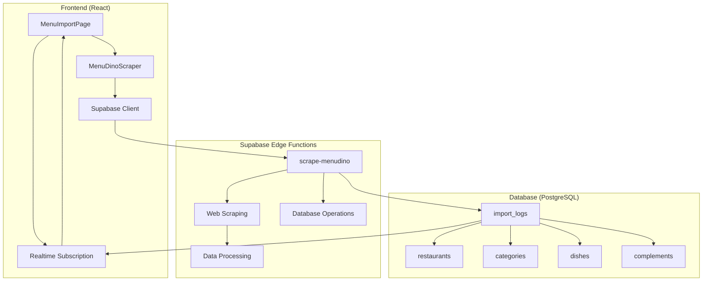
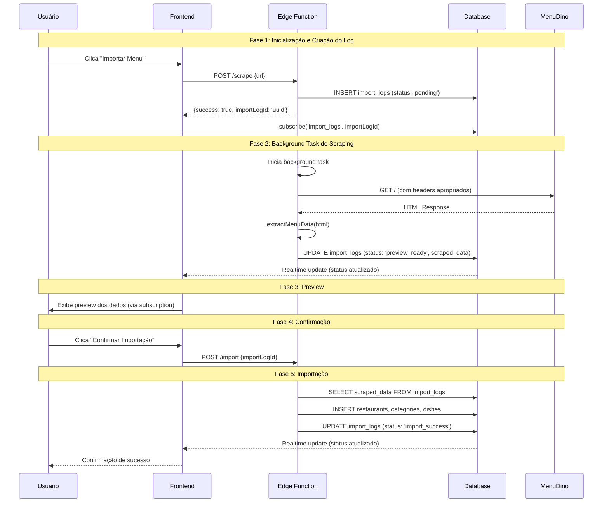
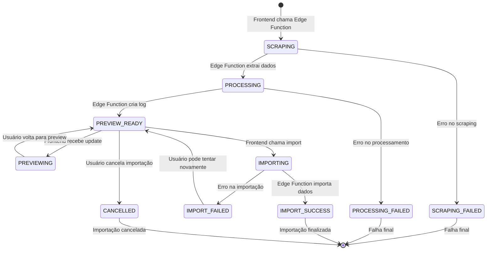
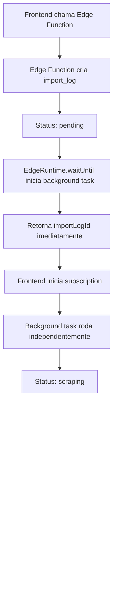
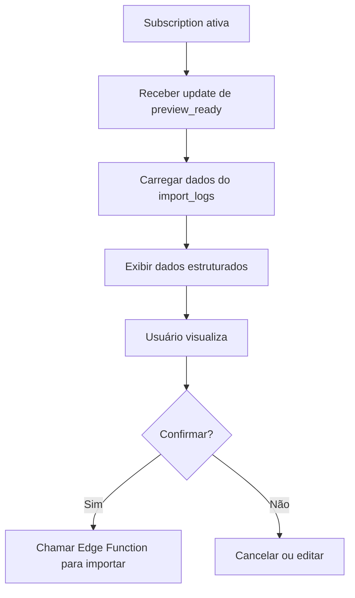
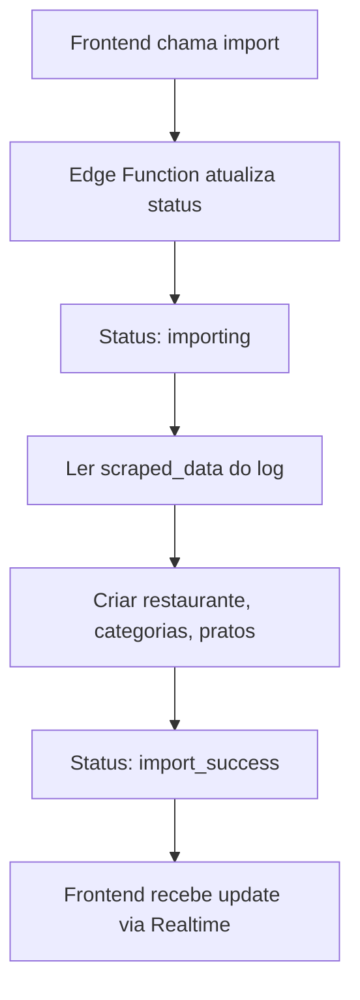

# 📚 **Documentação Completa: Sistema de Importação MenuDino com Edge Functions**

## 📋 **Índice**

1. [Visão Geral](#visão-geral)
2. [Arquitetura do Sistema](#arquitetura-do-sistema)
3. [Diagrama de Sequência](#diagrama-de-sequência)
4. [Estados e Transições](#estados-e-transições)
5. [Estrutura de Dados](#estrutura-de-dados)
6. [Implementação Técnica](#implementação-técnica)
7. [Fluxo de Operações](#fluxo-de-operações)
8. [Tratamento de Erros](#tratamento-de-erros)
9. [Monitoramento e Logs](#monitoramento-e-logs)
10. [Deploy e Configuração](#deploy-e-configuração)
11. [Testes e Validação](#testes-e-validação)
12. [Manutenção e Troubleshooting](#manutenção-e-troubleshooting)
13. [Considerações Finais](#considerações-finais)
14. [Referências e Recursos](#referências-e-recursos)

---

## 🎯 **1. Visão Geral**

O Sistema de Importação MenuDino é uma solução que resolve problemas de CORS e otimiza o processo de importação de menus de restaurantes. O sistema utiliza Supabase Edge Functions para fazer scraping de websites MenuDino e armazena os dados extraídos em uma tabela de logs, permitindo preview instantâneo e importação eficiente.

### **Problemas Resolvidos**
- ❌ **CORS Policy**: Bloqueio de requisições cross-origin
- ❌ **Reprocessamento**: Dados extraídos múltiplas vezes
- ❌ **Performance**: Lentidão no preview e importação
- ❌ **Auditoria**: Falta de rastreamento de tentativas

### **Soluções Implementadas**
- ✅ **Edge Functions**: Scraping server-side sem CORS
- ✅ **Cache Inteligente**: Dados salvos em `import_logs`
- ✅ **Preview Instantâneo**: Carregamento direto do banco
- ✅ **Importação Eficiente**: Uso apenas do ID de referência
- ✅ **Atualizações em Tempo Real**: Frontend recebe mudanças via Supabase Realtime

---

## 🏗️ **2. Arquitetura do Sistema**



### **Componentes Principais**

1. **Frontend (React + TypeScript)**
   - `MenuImportPage`: Interface de importação
   - `MenuDinoScraper`: Cliente de scraping
   - `Supabase Client`: Comunicação com backend
   - `Realtime Subscription`: Recebe atualizações em tempo real

2. **Edge Functions (Deno + Hono)**
   - `scrape-menudino`: Função de scraping
   - Processamento de HTML
   - Extração de dados estruturados
   - **Gerenciamento completo dos registros de importação**

3. **Database (PostgreSQL)**
   - `import_logs`: Tabela principal de logs
   - Tabelas de destino: `restaurants`, `categories`, `dishes`

---

## 🔄 **3. Diagrama de Sequência Atualizado**



### **Detalhamento das Fases**

#### **Fase 1: Inicialização**
- Usuário inicia processo de importação
- Frontend chama Edge Function com URL
- Frontend se inscreve para atualizações em tempo real

#### **Fase 2: Scraping e Criação do Log**
- Edge Function faz requisição para MenuDino
- Extrai dados do HTML recebido
- **Cria registro em `import_logs` diretamente**
- Frontend recebe atualização em tempo real

#### **Fase 3: Preview**
- Frontend recebe dados via subscription
- Exibe preview completo para usuário
- Dados já estão estruturados e prontos

#### **Fase 4: Confirmação**
- Usuário confirma importação
- Frontend chama Edge Function para importar
- Sistema marca log como "importing"

#### **Fase 5: Importação**
- Edge Function lê dados do `import_logs`
- Cria registros nas tabelas finais
- Atualiza status para "import_success"
- Frontend recebe atualização em tempo real

---

## 🔄 **4. Estados e Transições**

### **Diagrama de Estados**



### **Descrição dos Estados**

| Estado | Descrição | Criado/Atualizado por | Dados Disponíveis | Ações Possíveis |
|--------|-----------|----------------------|-------------------|-----------------|
| `SCRAPING` | Fazendo scraping | Edge Function | URL sendo processada | Aguardar |
| `PROCESSING` | Processando dados | Edge Function | Dados extraídos | Aguardar |
| `PREVIEW_READY` | Preview disponível | Edge Function | Todos os dados extraídos | Visualizar, confirmar, cancelar |
| `PREVIEWING` | Visualizando dados | Frontend | Dados carregados | Voltar, confirmar |
| `IMPORTING` | Importando dados | Edge Function | ID do log | Aguardar |
| `IMPORT_SUCCESS` | Importação concluída | Edge Function | Restaurante criado | Finalizar |
| `IMPORT_FAILED` | Falha na importação | Edge Function | Dados originais | Tentar novamente |
| `CANCELLED` | Importação cancelada | Frontend | Nenhum | Iniciar nova |
| `SCRAPING_FAILED` | Falha no scraping | Edge Function | Erro | Tentar novamente |
| `PROCESSING_FAILED` | Falha no processamento | Edge Function | Erro | Tentar novamente |

---

## ��️ **5. Estrutura de Dados**

### **Tabela `import_logs`**

```sql
CREATE TABLE public.import_logs (
  -- Identificação
  id uuid PRIMARY KEY DEFAULT gen_random_uuid(),
  user_id uuid REFERENCES public.profiles(id) ON DELETE CASCADE,
  restaurant_id uuid REFERENCES public.restaurants(id) ON DELETE SET NULL,
  
  -- Metadados básicos
  url text NOT NULL,
  status text NOT NULL CHECK (status IN (
    'scraping', 'processing', 'preview_ready', 
    'importing', 'import_success', 'import_failed',
    'scraping_failed', 'processing_failed', 'cancelled'
  )),
  source text NOT NULL DEFAULT 'menudino',
  
  -- Dados extraídos (completos para preview)
  scraped_data jsonb,
  
  -- Metadados de processamento
  error_message text,
  duration_ms integer,
  items_processed integer DEFAULT 0,
  items_total integer DEFAULT 0,
  categories_count integer DEFAULT 0,
  dishes_count integer DEFAULT 0,
  complements_count integer DEFAULT 0,
  
  -- Campos de auditoria
  metadata jsonb DEFAULT '{}',
  created_at timestamptz NOT NULL DEFAULT now(),
  updated_at timestamptz NOT NULL DEFAULT now(),
  
  -- Campos para controle de estado
  started_at timestamptz,
  completed_at timestamptz,
  retry_count integer DEFAULT 0
);
```

### **Estrutura do `scraped_data`**

```typescript
interface ScrapedData {
  restaurant: {
    name: string;
    cuisine_type?: string;
    address?: string;
    phone?: string;
    image_url?: string;
  };
  categories: string[];
  menu_items: {
    name: string;
    category: string;
    price: number;
    description?: string;
  }[];
  extraction_metadata: {
    html_length: number;
    extracted_at: string;
    processing_time_ms: number;
    extraction_quality_score?: number;
  };
}
```

---

## ⚙️ **6. Implementação Técnica**

### **6.1 Background Tasks no Supabase Edge Functions**

O Supabase Edge Functions suporta background tasks usando `EdgeRuntime.waitUntil(promise)`. Esta funcionalidade permite:

- **Executar tarefas assíncronas** sem bloquear a resposta da requisição
- **Responder rapidamente** aos usuários enquanto o processamento continua
- **Manter a instância da função ativa** até que a promise seja resolvida

#### **Sintaxe Correta para Background Tasks**

```typescript
// ✅ CORRETO: Usar EdgeRuntime.waitUntil para background tasks
EdgeRuntime.waitUntil(asyncLongRunningTask())

// ❌ INCORRETO: Usar await que bloqueia a resposta
await asyncLongRunningTask()
```

#### **Configuração para Background Tasks Locais**

Para testar background tasks localmente, adicione ao `supabase/config.toml`:

```toml
[edge_runtime]
policy = "per_worker"
```

**⚠️ Nota**: Com `per_worker`, a função não recarrega automaticamente. É necessário reiniciar manualmente com `supabase functions serve`.

### **6.2 Edge Function com Hono (Atualizada)**

A Edge Function implementa o padrão de background tasks da seguinte forma:

1. **Criação Imediata do Log**: Cria registro em `import_logs` e retorna ID
2. **Início da Background Task**: Usa `EdgeRuntime.waitUntil()` para iniciar scraping
3. **Resposta Imediata**: Frontend recebe ID para iniciar subscription
4. **Processamento em Background**: Scraping e processamento continuam independentemente

#### **Estrutura da Edge Function**

A Edge Function é organizada em três componentes principais:

1. **Rota `/scrape`**: Cria log e inicia background task
2. **Rota `/import`**: Processa importação final dos dados
3. **Funções auxiliares**: Gerenciamento de logs e processamento de dados

#### **Fluxo de Background Task**

```typescript
// 1. Criar registro imediatamente
const importLog = await createImportLog(url, userId, 'pending');

// 2. Iniciar background task (NÃO usar await)
EdgeRuntime.waitUntil(startBackgroundScraping(importLog.id, url, userId));

// 3. Retornar ID imediatamente
return c.json({ success: true, importLogId: importLog.id });
```

### **6.3 Cliente de Scraping Simplificado**

O frontend se torna um cliente simples que:

1. **Chama Edge Function** para iniciar importação
2. **Recebe ID do log** imediatamente
3. **Inicia subscription** para atualizações em tempo real
4. **Exibe progresso** conforme recebe atualizações

#### **Principais Mudanças**

- **Remoção de lógica complexa**: Edge Function gerencia todo o processo
- **Retorno simplificado**: Apenas ID do log para subscription
- **Tratamento de erros**: Centralizado na Edge Function
- **Status tracking**: Via Supabase Realtime

---

## 🔄 **7. Fluxo de Operações**

### **7.1 Fluxo de Scraping (Criação + Background Task)**



### **7.2 Fluxo de Preview (Dados via Subscription)**



### **7.3 Fluxo de Importação (Edge Function Controla Tudo)**



### **7.4 Vantagens da Nova Abordagem**

1. **⚡ Responsividade**: Frontend recebe ID imediatamente
2. **🔄 Background Processing**: Scraping roda independentemente via `EdgeRuntime.waitUntil`
3. **⚡ UX Melhorada**: Usuário vê progresso em tempo real
4. **🔧 Arquitetura Limpa**: Separação clara entre criação e processamento
5. **📊 Status Tracking**: Frontend pode mostrar progresso desde o início
6. **🔄 Realtime Updates**: Atualizações automáticas via Supabase
7. **🛡️ Confiabilidade**: Edge Function controla todo o fluxo
8. **📈 Escalabilidade**: Background tasks não bloqueiam o frontend

### **7.5 Comparação: Antes vs Depois**

#### **Antes (Síncrono)**
1. Frontend chama Edge Function
2. Edge Function faz scraping completo
3. Edge Function retorna dados + status
4. Frontend exibe resultado

#### **Depois (Assíncrono + Background Task)**
1. Frontend chama Edge Function
2. **Edge Function cria log e retorna ID imediatamente**
3. **Frontend inicia subscription com o ID**
4. **Edge Function inicia background task para scraping**
5. **Frontend recebe atualizações em tempo real**
6. **Usuário vê progresso desde o início**

Esta abordagem torna o sistema muito mais responsivo e oferece uma experiência de usuário superior, pois o usuário vê o progresso em tempo real desde o momento que clica no botão.

---

## 🚨 **8. Tratamento de Erros**

### **8.1 Tipos de Erro e Estados**

| Tipo de Erro | Causa | Estado Resultante | Ação do Sistema |
|--------------|-------|-------------------|-----------------|
| **CORS Error** | Política de segurança do navegador | `scraping_failed` | Log de erro, usuário pode tentar novamente |
| **Network Error** | Falha na conexão | `scraping_failed` | Log de erro, sugestão de retry |
| **Parse Error** | HTML malformado | `processing_failed` | Log de erro, análise do HTML |
| **Validation Error** | Dados inválidos | `processing_failed` | Log de erro, sugestão de correção |
| **Database Error** | Falha no banco | `import_failed` | Rollback automático, log de erro |

### **8.2 Estratégias de Recuperação**

#### **Retry Automático para Falhas de Rede**
- **Exponencial Backoff**: Intervalos crescentes entre tentativas
- **Máximo de 3 tentativas** para evitar loops infinitos
- **Log detalhado** de cada tentativa para debugging

#### **Fallback para Dados Parciais**
- **Salvar dados válidos** mesmo com falhas parciais
- **Marcar campos problemáticos** para revisão manual
- **Permitir importação parcial** com avisos ao usuário

#### **Notificação de Erros**
- **Toast notifications** para erros críticos
- **Logs detalhados** no console para desenvolvedores
- **Sugestões de ação** para o usuário

---

## 📊 **9. Monitoramento e Logs**

### **9.1 Estrutura de Logs**

O sistema implementa logging em múltiplas camadas:

#### **Logs da Edge Function**
- **Console logs** para debugging em tempo real
- **Structured logging** com timestamps e contextos
- **Error tracking** com stack traces completos

#### **Logs do Frontend**
- **User actions** para auditoria de uso
- **Performance metrics** para otimização
- **Error boundaries** para captura de falhas

#### **Logs do Banco de Dados**
- **Audit trail** completo em `import_logs`
- **Performance metrics** (duração, itens processados)
- **Status transitions** para debugging

### **9.2 Métricas de Performance**

#### **Tempo de Resposta**
- **Tempo até primeiro byte**: Criação do log
- **Tempo de scraping**: Processamento da página
- **Tempo total**: Da criação até importação final

#### **Taxa de Sucesso**
- **Scraping success rate**: % de páginas processadas com sucesso
- **Import success rate**: % de dados importados corretamente
- **Error distribution**: Análise dos tipos de erro mais comuns

#### **Uso de Recursos**
- **Memory usage**: Consumo de memória durante processamento
- **CPU usage**: Utilização de processamento
- **Network calls**: Número de requisições externas

---

## 🚀 **10. Deploy e Configuração**

### **10.1 Deploy da Edge Function**

#### **Desenvolvimento Local**
```bash
# 1. Navegar para o diretório da função
cd supabase/functions/scrape-menudino

# 2. Configurar variáveis de ambiente
cp .env.example .env.local
# Editar .env.local com suas configurações

# 3. Deploy para desenvolvimento local
supabase functions serve scrape-menudino --env-file .env.local

# 4. Testar localmente
curl -X POST http://localhost:54321/functions/v1/scrape-menudino/scrape \
  -H "Content-Type: application/json" \
  -d '{"url": "https://test.menudino.com.br/"}'
```

#### **Produção**
```bash
# 1. Deploy para produção
supabase functions deploy scrape-menudino --project-ref YOUR_PROJECT_ID

# 2. Verificar status
supabase functions list --project-ref YOUR_PROJECT_ID

# 3. Ver logs em produção
supabase functions logs scrape-menudino --project-ref YOUR_PROJECT_ID
```

### **10.2 Configuração de Ambiente**

#### **Variáveis Obrigatórias**
```bash
# .env.local / .env.production
SUPABASE_URL=http://localhost:54321  # ou URL de produção
SUPABASE_ANON_KEY=your_anon_key
SUPABASE_SERVICE_ROLE_KEY=your_service_role_key
```

#### **Variáveis Opcionais**
```bash
# Configurações de performance
MAX_RETRIES=3
SCRAPING_TIMEOUT=30000
MAX_CONCURRENT_SCRAPES=5

# Configurações de logging
LOG_LEVEL=info
ENABLE_DEBUG_LOGS=true
```

### **10.3 Configuração do Supabase**

#### **config.toml para Background Tasks**
```toml
[functions.scrape-menudino]
verify_jwt = false
import_map = "./deno.json"

[edge_runtime]
policy = "per_worker"  # Necessário para background tasks

[functions.scrape-menudino.environment]
ENVIRONMENT = "production"
LOG_LEVEL = "info"
MAX_RETRIES = "3"
SCRAPING_TIMEOUT = "30000"
```

---

## 🧪 **11. Testes e Validação**

### **11.1 Estratégia de Testes**

#### **Testes Unitários**
- **Funções de extração**: Validação de parsing de HTML
- **Funções de validação**: Verificação de dados extraídos
- **Funções de banco**: Operações CRUD em `import_logs`

#### **Testes de Integração**
- **Edge Function completa**: End-to-end do fluxo de scraping
- **Supabase Realtime**: Verificação de atualizações em tempo real
- **Database operations**: Criação e atualização de registros

#### **Testes de Performance**
- **Tempo de resposta**: Latência da criação do log
- **Background task duration**: Duração do scraping
- **Concurrent requests**: Múltiplas importações simultâneas

### **11.2 Cenários de Teste**

#### **Cenários de Sucesso**
1. **URL válida do MenuDino**: Scraping completo e importação
2. **Múltiplas categorias**: Processamento de menus complexos
3. **Dados completos**: Restaurante, categorias e pratos
4. **Importação parcial**: Dados com campos opcionais

#### **Cenários de Erro**
1. **URL inválida**: Tratamento de URLs malformadas
2. **Página não encontrada**: HTTP 404 e outros códigos de erro
3. **HTML malformado**: Parsing de páginas com estrutura inválida
4. **Timeout de rede**: Falhas de conectividade
5. **Erro de banco**: Falhas na persistência de dados

#### **Cenários de Edge Case**
1. **Páginas muito grandes**: HTML com muitos elementos
2. **Caracteres especiais**: Nomes com acentos e símbolos
3. **Preços variados**: Diferentes formatos de preço
4. **Categorias aninhadas**: Estruturas hierárquicas complexas

---

## 🔧 **12. Manutenção e Troubleshooting**

### **12.1 Problemas Comuns**

#### **Edge Function não responde**
**Sintomas**: Timeout ou erro 500
**Causas**: 
- Background task travada
- Memory leak
- Timeout de rede

**Soluções**:
```bash
# Verificar logs
supabase functions logs scrape-menudino

# Verificar status
supabase functions list

# Reiniciar função
supabase functions serve scrape-menudino --env-file .env.local
```

#### **Background task não executa**
**Sintomas**: Status fica em "pending" indefinidamente
**Causas**:
- Configuração incorreta de `edge_runtime.policy`
- Erro na função `startBackgroundScraping`
- Instância da função terminada prematuramente

**Soluções**:
```toml
# Verificar config.toml
[edge_runtime]
policy = "per_worker"

# Verificar logs da função
supabase functions logs scrape-menudino --follow
```

#### **Dados não sendo salvos**
**Sintomas**: Preview não aparece ou dados incompletos
**Causas**:
- Falha na criação do log inicial
- Erro na atualização do status
- Problema de permissões no banco

**Soluções**:
```sql
-- Verificar se a tabela import_logs existe
SELECT * FROM information_schema.tables 
WHERE table_name = 'import_logs';

-- Verificar políticas RLS
SELECT * FROM pg_policies 
WHERE tablename = 'import_logs';

-- Verificar dados na tabela
SELECT * FROM import_logs ORDER BY created_at DESC LIMIT 5;
```

### **12.2 Monitoramento de Performance**

#### **Métricas de Saúde**
- **Uptime**: Disponibilidade da Edge Function
- **Response time**: Tempo de resposta médio
- **Error rate**: Taxa de erros por período
- **Success rate**: Taxa de sucesso das importações

#### **Alertas Automáticos**
- **High error rate**: >5% de erros em 5 minutos
- **Slow response**: >30 segundos para criação de log
- **Background task failure**: Falhas consecutivas de scraping
- **Database errors**: Problemas de conexão ou permissões

### **12.3 Limpeza e Manutenção**

#### **Limpeza de Logs Antigos**
```sql
-- Limpar logs antigos (manter apenas últimos 30 dias)
DELETE FROM import_logs 
WHERE created_at < NOW() - INTERVAL '30 days'
AND status IN ('import_success', 'cancelled');

-- Limpar logs com falha (manter apenas últimos 7 dias)
DELETE FROM import_logs 
WHERE created_at < NOW() - INTERVAL '7 days'
AND status IN ('scraping_failed', 'processing_failed', 'import_failed');
```

#### **Otimização de Performance**
- **Índices de banco**: Para consultas frequentes
- **Cache de dados**: Para URLs frequentemente acessadas
- **Rate limiting**: Para evitar sobrecarga do MenuDino
- **Connection pooling**: Para operações de banco eficientes

---

## 📝 **13. Considerações Finais**

### **13.1 Benefícios da Implementação**

O sistema de importação MenuDino com Edge Functions oferece:

1. **🚀 Performance Superior**: Background tasks não bloqueiam o frontend
2. **⚡ Experiência em Tempo Real**: Atualizações via Supabase Realtime
3. **🔧 Arquitetura Robusta**: Separação clara de responsabilidades
4. **📊 Monitoramento Completo**: Logs e métricas detalhadas
5. **🛡️ Tratamento de Erros**: Recuperação automática e fallbacks
6. **📈 Escalabilidade**: Suporte a múltiplas importações simultâneas

### **13.2 Limitações e Considerações**

#### **Limitações Técnicas**
- **Timeout de Edge Functions**: Máximo de 60 segundos para background tasks
- **Memory limits**: Restrições de memória para processamento de HTML
- **Network reliability**: Dependência da estabilidade do MenuDino

#### **Considerações de Negócio**
- **Rate limiting**: Respeitar limites de requisições ao MenuDino
- **Data quality**: Validação de dados extraídos antes da importação
- **User experience**: Feedback claro sobre progresso e erros

### **13.3 Roadmap Futuro**

#### **Melhorias Planejadas**
1. **Cache inteligente**: Evitar re-scraping de URLs recentes
2. **Batch processing**: Processamento em lote de múltiplas URLs
3. **Machine learning**: Detecção automática de padrões de menu
4. **Multi-language support**: Suporte a diferentes idiomas
5. **Advanced validation**: Validação mais sofisticada de dados

#### **Integrações Futuras**
1. **Webhook notifications**: Notificações para sistemas externos
2. **Analytics dashboard**: Métricas avançadas de uso
3. **API pública**: Endpoints para integração com terceiros
4. **Mobile app**: Aplicativo móvel para importação

---

## 📚 **14. Referências e Recursos**

### **14.1 Documentação Oficial**
- [Supabase Edge Functions](https://supabase.com/docs/guides/functions)
- [Background Tasks](https://supabase.com/docs/guides/functions/background-tasks)
- [Supabase Realtime](https://supabase.com/docs/guides/realtime)
- [Row Level Security](https://supabase.com/docs/guides/auth/row-level-security)

### **14.2 Ferramentas e Bibliotecas**
- [Hono Framework](https://hono.dev): Framework web para Edge Functions
- [Deno Runtime](https://deno.land): Runtime JavaScript/TypeScript
- [PostgreSQL](https://www.postgresql.org): Banco de dados relacional

### **14.3 Comunidade e Suporte**
- [Supabase Discord](https://discord.supabase.com): Comunidade oficial
- [GitHub Issues](https://github.com/supabase/supabase/issues): Reportar bugs
- [Stack Overflow](https://stackoverflow.com/questions/tagged/supabase): Perguntas e respostas

---

**Nota**: Esta documentação assume familiaridade com o Supabase, Edge Functions e conceitos de desenvolvimento web. Recomenda-se consultar a [documentação oficial do Supabase](https://supabase.com/docs) para informações adicionais.

---

*Documentação gerada em: Janeiro 2025*  
*Versão: 1.0.0*  
*Última atualização: Sistema de Background Tasks com EdgeRuntime.waitUntil*
